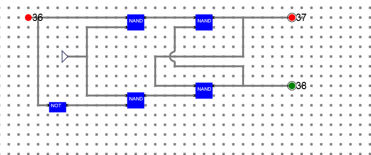
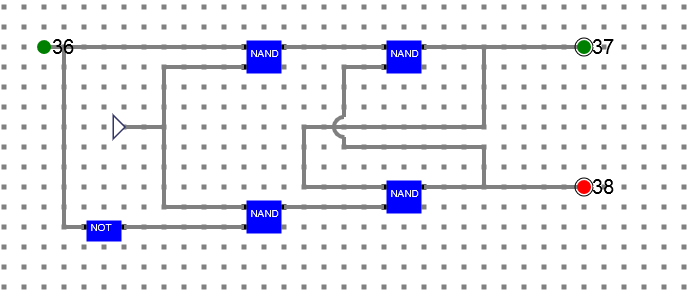

# Procedure

## Circuit diagram

#### Fig1: D Flip-Flop

 

#### Fig1: D Flip-Flop

- The circuit requires 4 NAND gates as shown and a clock. 

- Connectivity is also as shown in the diagram.

## Refer the simulator manual on how to design the circuit
- Manual --> [Click Here](./simulation/coavlNew.pdf)

<embed src="./simulation/coavlNew.pdf" type="application/pdf">

