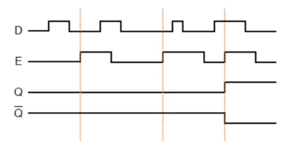

# Theory:

A **D** type flip-flop, wherein data penetrates via rising or falling clock pulses and which is received on output, is called **edge-triggered D flip-flop**. 

There are two types of edge triggered Flip-Flop – 

1. Positive Edge Trigger 
2. Negative Edge Trigger.

Here is the activation diagram for a positive edge trigger flip-flop where input is **D**, clock pulse **E** and outputs are **Q** and **~Q**.

#### Fig1: 1-bit Digital Comparator Circuit

The truth table for a positive edge trigger flip-flop is as below.

| D | Clock | Q | ~Q | Comments |
|:---:|:---:|:---:|:--:|:-:|
| 1 | 1 | 1 | 0 | SET (stores a 1) |
| 0 | 1 | 0 | 1 | RESET (stores a 0) |

