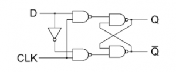

# Theory:

## What is Flip-Flop: 
A flip-flop is a circuit that maintains a state until directed by input to change the state. Flip-flop is popularly known as the basic digital memory circuit. It has its two states as logic 1(High) and logic 0(low) states. A flip flop is a sequential circuit which consist of single binary state of information or data. The digital circuit is a flip flop which has two outputs and are of opposite states. It is also known as a Bistable Multivibrator.

There many types of flip-flops like 

    a.  SR Flip-Flop
    b.	JK Flip-Flop
    c.	D Flip-Flop
    d.	T Flip-Flop

## Latch

A latch is a type of temporary storage device that can hold a single bit of data (0 or 1) until a new input signal changes its state. It's a fundamental building block in many digital systems like Flip-Flop, often used to store data temporarily before passing it on to other parts of the circuit. 

A diagram of simple S-R Latch is shown below.

#### Fig1. S-R Latch Diagram

The truth table of the S-R Latch is shown below.

#### Truth table for S-R Latch

| S | R | Q | Q' | 
|:---:|:---:|:---:|:---:|
| 0 | 0 | Latch | Latch |
| 0 | 1 | 0 | 1 |
| 1 | 0 | 1 | 0 |
| 1 | 1 | 0 | 0 |

Here we’ll discuss with D Flip-Flop.

## D Flip-Flop:
The D Flip-Flop consists a single data input (D), a clock input (CLK) and two outputs: Q and Q’ (the complement of Q).

Given Below is the Diagram of D Flip-Flop.

#### Fig2. D Flip-Flop Diagram

A D type flip-flop, wherein data penetrates via rising or falling clock pulses and which is received on output, is called edge-triggered D flip-flop.
Here is the activation diagram for a positive edge trigger flip-flop where input is D, clock pulse E and outputs are Q and ~Q.
 

#### Fig3. Activation Diagram of Positive Edge Trigger D Flip-Flop

In this activation diagram, vertical pink lines are pointing out the time where there is a positive edge of the clock pulse. 
- A -->	At the 1st pink line from left, when there is a positive edge of the clock pulse E, D is low. Hence output Q is low.
- B -->	At the 2nd pink line from left again there is a positive edge of the clock pulse E and D is low. Hence Q is still low.
- C -->	At the last pink line, again there is a positive edge of the clock pulse E and D is high. Hence Q is high.

The truth table of the positive edge trigger D flip-flop is as below.

| D | Clock | Q | ~Q | Comments |
|:---:|:---:|:---:|:--:|:-:|
| 1 | 1 | 1 | 0 | SET (stores a 1) |
| 0 | 1 | 0 | 1 | RESET (stores a 0) |

So the input state moves to output only when clock pulse is high. Otherwise the state of the flip-flop does not change. The truth table is also a representation of Fig2.
